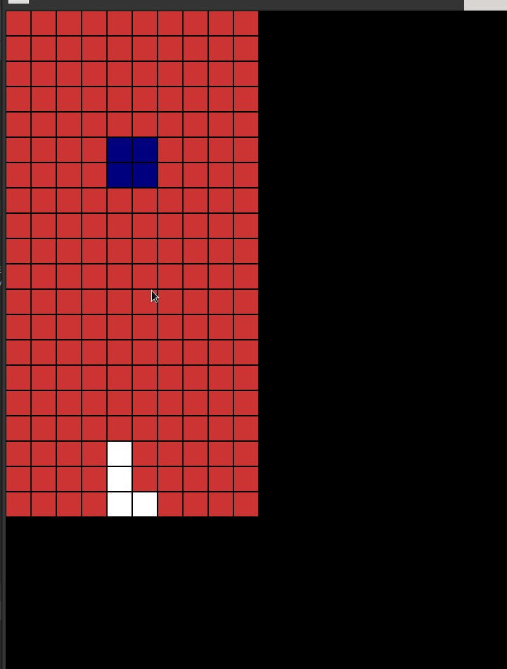
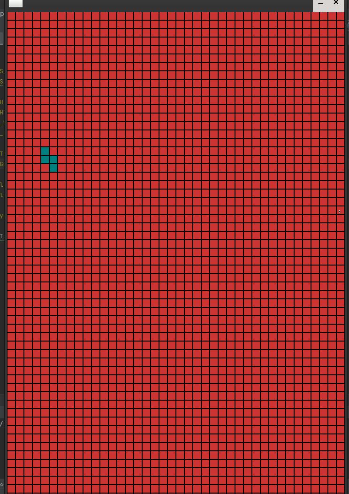
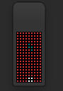

## Basic Tetris Game

* Game Loop
  * event handler
    * keyboard
    *quit
  * Collision check
  * Down one time for every period
  * Draw

### How does it work

Create Window

Render BackGround

Create a double dimensional array -> Elements are false

Draw array elements as different colour

select random object type, catching event select movement and rotation type

Render object

Every 500 sec later, move this object to one sub array

#### General information
in lib/include/Defines.h
there is some defines u can play like me :D

